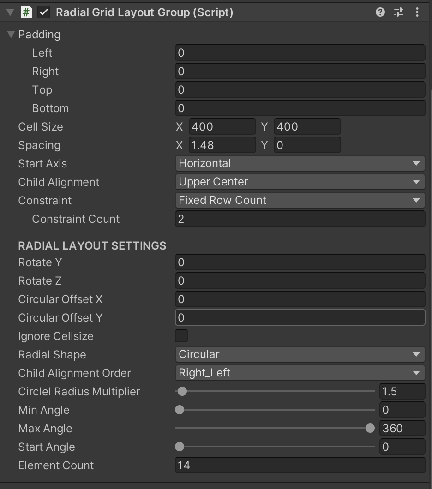

# RadialGridLayoutGroup

`RadialGridLayoutGroup` is a custom Unity layout group that arranges UI elements in a radial pattern. It extends `GridLayoutGroup` to provide flexible and visually appealing radial layouts, supporting circular, spiral, and parabolic shapes.

## Features

- **Radial Layouts**: Arrange elements in circular, spiral, or parabolic patterns.
- **Customizable Settings**: Adjust rotation, offsets, distance, and angular constraints.
- **Flexible Alignment**: Align child elements from left to right or right to left.
- **Editor Visualization**: Visualize radial layouts in the Unity editor using Gizmos.

## Enum Types

### ChildAlignmentOrder
Defines the order of child alignment.
- `Left_Right`
- `Right_Left`

### RadialShape
Defines the shape of the radial layout.
- `Circular`
- `Spiral`
- `Parabolic`

## Serialized Fields

- `m_RotateY`: Rotation angle around the Y-axis.
- `m_RotateZ`: Rotation angle around the Z-axis.
- `m_CircularOffsetX`: Horizontal offset for circular layouts.
- `m_CircularOffsetY`: Vertical offset for circular layouts.
- `m_IgnoreCellsize`: Ignore the cell size setting if true.
- `m_fDistance`: Distance factor for element positioning.
- `m_RadialShape`: Shape of the radial layout (Circular, Spiral, Parabolic).
- `m_ChildAlignmentOrder`: Order of child alignment (Left_Right, Right_Left).
- `m_CirclelRadiusMultiplier`: Multiplier for the circle's radius.
- `m_MinAngle`: Minimum angle for the radial layout.
- `m_MaxAngle`: Maximum angle for the radial layout.
- `m_StartAngle`: Start angle for the radial layout.
- `m_ElementCount`: Number of elements in the layout.

## Methods

### OnEnable()
Caches active child transforms and calculates the radial layout when the component is enabled.

### CacheActiveChildTransforms()
Clears and repopulates the list of active child `RectTransform`s.

### CalculateRadial()
Computes the positions of child elements based on the radial shape and alignment settings.

### CalculateCircumferenceWithShape(Vector2 totalSize, int currentRow, int currentCol)
Calculates the circumference of the layout for different shapes.

### ApplyChildAlignment(ref Vector2 pivotOffset)
Adjusts the pivot offset based on the specified child alignment.

### OnDrawGizmos()
Draws Gizmos in the editor to visualize the radial layout based on `MinAngle`, `MaxAngle`, and `StartAngle`.

## Usage

To use the `RadialGridLayoutGroup` in your Unity project:

1. Attach the `RadialGridLayoutGroup` script to a `GameObject` containing a `RectTransform`.
2. Customize the serialized fields in the Unity inspector to achieve the desired radial layout.
3. Add child elements to the `GameObject` and observe the radial arrangement.

[Radial Grid Layout Inspector]

